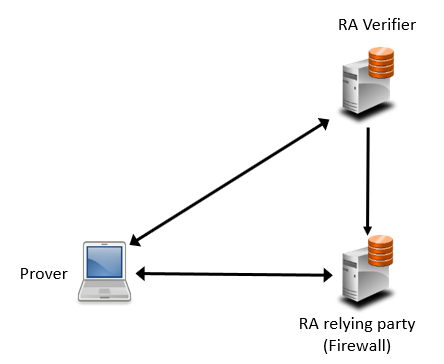

<!--
 * Copyright (c) 2023-2024 Peraton Labs
 * SPDX-License-Identifier: Apache-2.0

 * Distribution Statement “A” (Approved for Public Release, Distribution Unlimited).
-->
# The SEDIMENT Project

This material is based upon work supported by the DARPA OPS-5G program under
contract number HR001120C0156. Any opinions, findings, conclusions, or
recommendations expressed here are those of the authors and do not necessarily
reflect the views of DARPA.

This repository hosts references to SEDIMENT components and scripts to
build SEDIMENT or individual components from source. All files are released 
under the [Apache 2.0](LICENSE) license unless specifically noted otherwise.

SEDIMENTS components include an application server to receive IoT data 
(temperature and humidity sensor readings), a remote attestation server, 
a firewall to serve as the initial contact point for an IoT device running 
SEDIMENT (also known as prover). The majority of SEDIMENT is written in C++.
It is known to be compiled cleanly by GCC 9 or later versions.
The guide below assumes the servers are being 
installed on Ubuntu 20.04. Other Linux distributions are expected to 
have no issues, but have not been tested.

- [The SEDIMENT Project](#the-sediment-project)
  - [Install Third Party Libraries](#install-third-party-libraries)
  - [Build](#build)
  - [Configuring the Servers](#configuring-the-servers)
  - [Running the Servers](#running-the-servers)
    - [Remote Attestation Server (Verifier)](#remote-attestation-server-verifier)
    - [Firewall](#firewall)
  - [Test Configuration on Linux](#test-configuration-on-linux)
    - [Using A Raspberry Pi Zero W](#using-a-raspberry-pi-zero-w)
    - [Using A Zephyr Device](#using-a-zephyr-device)

## Install Third Party Libraries
A few 3rd party libraries are required for the remote attestation server and the firewall. 
Run the following command to install the dependent libraries on Ubuntu.

        $ $SEDIMENT/utils/install-libraries.sh

Note that mbedtls 3.1.0 and mqtt C and C++ libraries need to be installed separately.        
Please download and install mbedtls version 3.1.0 from https://github.com/Mbed-TLS/mbedtls.
The latest version may also work, but 3.1.0 is the version tested.
Please also download and install mqtt C++ and C libraries from 
https://github.com/eclipse/paho.mqtt.cpp and
https://github.com/eclipse/paho.mqtt.c, respectively.

## Build
- Build the SEDIMENT executables, with support for sqlite only, as follows

        $ cd $SEDIMENT
        $ mkdir build; cd build
        $ cmake ..; make

- To add support for MySQL, add '-DMYSQL_ENABLED=ON' to the cmake command.
        $ cmake .. -DMYSQL_ENABLED=ON ; make

## Configuring the Servers
By default, the servers are configured using files contained in configs/boards.
They specify settings such as IP address, port, and key materials. 
This server configuration files are usually generated, along with matching 
configurations for the deivces, using the provisioner in $SEDIMENT/configs/provision. 
See [Provision](../configs/provision/README.md) for more information. 
For devices running Zephyr, see [Devices](../apps/zephyr/README.md) 
for flashing configurations to the devices. 

To change the settings for a server, you can edit and save the corresponding file in configs/boards
and restart the corresponding server, using the command line option -c. 
For example, if the firewall is to use a config file named fw.cfg, do the following,

        $ $SEDIMENT/build/firewall -c fw.cfg

The following are the default configuration files in configs/boards for the servers and the Linux/RPi prover.
```
        firewall: RA_Manager
        verifier: RAP_Server
        Linux/RPi prover: Ubuntu-001
```

## Running the Servers
The servers and the RPI prover share the following command line options.
```
--config <config-file>
  Configuration file, default is app dependent.

--database <Argument>
  Use the specified device database. <Argument> can be one of 
    <sqlite database file> for sqlite
    <url>,<user>,<pass>,<device database> for MySQL
  Default to $SEDIMENT/data/sediment.db

--sediment-home <sediment home directory>
  SEDIMENT installation directory, overriding the envrionment variable SEDIMENT

--database-impl [ sqlite | mysql ]
  Database implementation, default to sqlite

--log-level [off, trace, debug, info, warning, error, critical]
  Logging level, default to 'debug'

--console-log-level [off, trace, debug, info, warning, error, critical]
  Console logging level, default to 'debug'

--log-dir <log-dir>
  Write log files to this directory, defaults to '$SEDIMENT/logs'

--log-file <log file>
  Log file name, default to <executable name>.log

--log-max-size <MB>
  Maximum log file size, default to 512 MB

--log-max-files <int>
  Maximum number of rotating log files, default to 3

--version
  Display the version number

--help/-h
  This help.
```

### Remote Attestation Server (Verifier)

        $ cd $SEDIMENT/build
        $ ./verifier

The verifier specific command line options are the following.
```
--api-port/-a <port>
  Listen on the port for connection for service

--block-size/-b <block-size>
  Use the specified block size instead of the full firmware size in RA

--gui-port/-g <port>
  Listen on the port for connection from the GUI

--no-gui/-n
  Run without GUI

--signing-key/-s <pem-key>
  RSA signing key in pem
```

### Firewall

        $ cd $SEDIMENT/build
        $ ./firewall

The firewall specific command line options are the following.
```
--verify-key/-v <pem-key>
  RSA verifying key in pem, default to $SEDIMENT/data/verify_key.pem
```


## Test Configuration on Linux
The following is a diagram showing the minimum test configuration where the firewall, 
the application server, the verifier (remote attestation server), 
their GUI's and the device (a virutal one) are all running on the same Ubuntu PC. 



To run SEDIMENT on an Ubuntu PC, execute the following commands, each in a separate terminal window.
```
        $ $SEDIMENT/build/firewall
        $ $SEDIMENT/build/verifier
        $ $SEDIMENT/build/prover
```
After the device connects to the servers, there should be messages in the terminals, 
showing messages being exchanged among the servers and the device. 
The attestation status and history should show up on the attestation server GUI.

If a remote attestation fails because of invalid firmware HMAC checksum in the verifier, 
the firmware record on the server needs to be corrected. 
Copy the new firmware to the server directory as follows.

```
        $ cp $SEDIMENT/build/prover $SEDIMENT/data/testfiles/ubuntu
```
Restart both the verifier and the device. If remote attestation is successful, 
one should see a log message containing "all evidence verified for device Ubuntu-001"
in the verifier terminal. Note that one of the evidence types attested is the OS Version, 
which is "Ubuntu 20.04.3 LTS" in the database. If you are running on a different version, 
please update the osVersion column of the database accordingly.

### Using A Raspberry Pi Zero W
Prepare RPi0 as follows.

- Build the prover.
```
    $ cd $SEDIMENT
    $ mkdir build; cd build
    $ cmake ..
    $ cmake --build . --target prover
```

- Copy the executable from RPi0 to the Ubuntu PC (hostname is ubuntu below)
```
    # scp $SEDIMENT/build/prover ubuntu:$SEDIMENT/data/testfiles/rpi
```
- On the server PC, update the (default) database $SEDIMENT/data/sediment.db 
  and change the verifierEndpoint column to match the IP address of the PC 
  in the row corresponding to the device, e.g. RPI-001.

- On the RPi, edit the config file, e.g. $SEDIMENT/configs/boards/RPI-001 and 
  change the IP address in the row containing 'prover outgoing'.

On PC, run the following, each in a separate terminal
```
        $ $SEDIMENT/build/firewall
        $ $SEDIMENT/build/verifier
```

On RPi
```
        $ $SEDIMENT/build/prover -c $SEDIMENT/configs/boards/RPI-001
```

The RPI prover does not have additional command line options, other than the common ones.

### Using A Zephyr Device
Prepare a zephyr device as follows.

- Build and download the firmware and configurations as described in 
  [SEDIMENT App on Zephyr](apps/zephyr/README.md). 

- Copy the firmware to make it visible to the verifier. For example, 

        $ cp $ZEPHYR/build/zephyr/zephyr.bin $SEDIMENT/data/testfiles/zephyr-GG.bin

- On the server PC, update the (default) database $SEDIMENT/data/sediment.db 
  and change the firmware and size columns of the row corresponding to the device, e.g. Giant_Gecko-001.

On PC
```
        $ $SEDIMENT/build/firewall
        $ $SEDIMENT/build/verifier
```
Power on the Giant Gecko.
